# 🧠 AI Language Tutor

[](https://n8n.io/)
[](https://supabase.com/)
[](https://elevenlabs.io/)
[](https://openrouter.ai/)

> **An intelligent AI-powered language tutor that provides personalized learning experiences through automated workflows, natural conversation, and voice interaction.**

This project creates a sophisticated two-part AI Language Tutor using **n8n**, **Supabase**, and **ElevenLabs**. It delivers personalized language learning by leveraging user preferences, maintaining comprehensive chat history memory, generating contextual AI-driven responses, and providing high-quality text-to-speech audio replies.

## 📋 Table of Contents

- [🚀 Workflows Overview](#-workflows-overview)
- [🧩 Tech Stack](#-tech-stack)
- [🧰 Project Structure](#-project-structure)
- [🎥 Demo](#-demo)
- [🚀 Getting Started](#-getting-started)
- [👤 Author](#-author)

---

## 🚀 Workflows Overview
This project consists of **two core n8n workflows** that work together to create a seamless user experience.

### 1️⃣ User Onboarding Workflow

| Component | Details |
|-----------|---------|
| **Purpose** | Collect and store language learning preferences for each new user |
| **Trigger** | `POST` request to webhook endpoint: `/user-onboarding` |
| **Action** | Saves user data to `user_preferences` table in Supabase database |
| **Output** | JSON response confirming successful registration |

**Response Format:**
```json
{
  "status": "success",
  "message": "User preferences saved successfully."
}
```


### 2️⃣ Conversational Tutor Workflow

| Component | Details |
|-----------|---------|
| **Purpose** | Respond intelligently to user chat messages with personalized tutoring |
| **Trigger** | `POST` request to webhook endpoint: `/chat-message` |

#### 🔄 **Processing Pipeline:**

1. **📚 Context Retrieval**
   - Fetches user's stored preferences from database
   - Retrieves last 10 messages from chat history for context

2. **🤖 AI Processing**
   - Constructs smart, context-aware prompt for language model
   - Generates personalized response using **LLaMA 4 Maverick** (via OpenRouter)

3. **💾 Data Persistence**
   - Saves user's new message to `chat_history` table
   - Stores AI's response in Supabase database

4. **🔊 Audio Generation**
   - Converts AI text response to high-quality speech using **ElevenLabs API**
   - Returns generated audio file directly in webhook response

---

## 🧩 Tech Stack

<div align="center">

| Technology | Purpose | Description |
|:----------:|:-------:|:------------|
|  | **Automation** | Core platform for building and orchestrating workflows |
|  | **Database** | Real-time database for user preferences and chat history |
|  | **AI Models** | LLaMA 4 Maverick for intelligent conversation generation |
|  | **Text-to-Speech** | High-quality voice synthesis for audio responses |

</div>

---

## 🧰 Project Structure

| 📁 File | 📝 Description | 🏷️ Type |
|:---------|:---------------|:---------|
| `Workflow1_UserOnboarding.json` | n8n workflow for onboarding new users and storing preferences | **Workflow** |
| `Workflow2_ConversationalTutor.json` | Main n8n workflow powering the AI tutor chat system | **Workflow** |
| `User_Preferences_Table.sql` | SQL schema for user preferences table structure | **Database** |
| `Chat_History_Table.sql` | SQL schema for chat history table structure | **Database** |

### 🏗️ **Architecture Overview**

```mermaid
graph TD
    A[👤 User Request] --> B[🌐 Webhook Trigger]
    B --> C{🔀 Route Type}
    
    C -->|onboarding| D[📝 User Onboarding]
    C -->|chat| E[💬 Conversational Tutor]
    
    D --> F[💾 Store Preferences]
    F --> G[✅ Success Response]
    
    E --> H[📚 Fetch Context]
    H --> I[🤖 AI Processing]
    I --> J[💾 Save Messages]
    J --> K[🔊 Generate Audio]
    K --> L[📤 Return Audio Response]
    
    style A fill:#e1f5fe
    style G fill:#c8e6c9
    style L fill:#c8e6c9
```



---

## 🎥 Demo

> **Experience the AI Language Tutor in action!**

You can view a comprehensive video walkthrough of the automation setup and see the project in action:

[](https://your-video-link-here)

*Replace the link above with your actual demo video URL*

---

## � Getting Started

### Prerequisites

- [ ] **n8n** instance (cloud or self-hosted)
- [ ] **Supabase** account and project
- [ ] **ElevenLabs** API key
- [ ] **OpenRouter** API key

### Quick Setup

1. **Import Workflows**
   ```bash
   # Import the workflow files into your n8n instance
   - Workflow1_UserOnboarding.json
   - Workflow2_ConversationalTutor.json
   ```

2. **Database Setup**
   ```sql
   -- Run the SQL files in your Supabase project
   User_Preferences_Table.sql
   Chat_History_Table.sql
   ```

3. **Configure API Keys**
   - Set up your ElevenLabs API credentials
   - Configure OpenRouter API access
   - Connect Supabase database credentials

4. **Test Endpoints**
   - User Onboarding: `POST /user-onboarding`
   - Chat Message: `POST /chat-message`

---

## 🤝 Contributing

Contributions are welcome! Please feel free to submit a Pull Request.

1. Fork the project
2. Create your feature branch (`git checkout -b feature/AmazingFeature`)
3. Commit your changes (`git commit -m 'Add some AmazingFeature'`)
4. Push to the branch (`git push origin feature/AmazingFeature`)
5. Open a Pull Request

---

## 📄 License

This project is licensed under the MIT License - see the [LICENSE](LICENSE) file for details.

---

## 👤 Author

<div align="center">

**Vinay Kumar**

[](https://github.com/Vinay-kumar-code)
[](https://linkedin.com/in/your-profile)

*Built as part of the AI Internship Assignment*

</div>

---

<div align="center">

### ⭐ If you found this project helpful, please give it a star!

**Made with ❤️ and AI**

</div>
